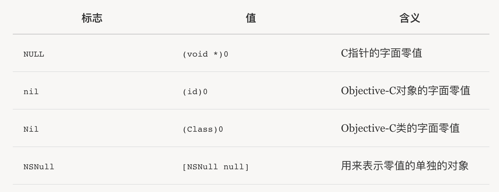

# nil/NSNull

## 前言
之前在写项目的时候曾经踩过的一个基础知识的坑(*在fmdb中某些字段可以为null，查询获取该字段会返回NSNull对象*)，现在总结一下。

## 区别
* nil: A null pointer to an Objective-C object.——`#define nil ((id)0)`
* Nil: A null pointer to an Objective-C class.
* NULL: A null pointer to anything else,  is for C-style memory pointers.——`#define NULL ((void *)0)`
* NSNull: A class defines a singleton object used to represent null values in collection objects (which don't allow nil values).
`[NSNull null]`: The singleton instance of NSNull.




## 防止NSNull引起的崩溃
OC允许向nil发送消息，而NSNull本神是一个NSObject，它只有一个类方法：`+ (NSNull *)null;`，向其发送其他消息自然会容易引起崩溃。

* 最直接的方法是`_model.url && (NSNull *)_model.url != [NSNull null] && ![_model.url isEqualToString:@""]`

* 如果知道那些字段会引起这个问题(例如使用FMDB的时候)，可以直接为NSDictionary写上一个Category（和上面的方法差不多）：

```
@implementation NSDictionary (Verified)

- (id)verifiedObjectForKey:(id)aKey
{
    if ([self objectForKey:aKey] && ![[self objectForKey:aKey] isKindOfClass:[NSNull class]]) {
    	return [self objectForKey:aKey];
    }
    return nil;
}
```

* 写一个NSNull的category，在category中实现常用的容易引起NSNull崩溃的函数，例如:

```
- (NSUInteger)length { return 0; }

- (NSInteger)integerValue { return 0; };

- (float)floatValue { return 0; };

- (NSString *)description { return @"0"; }

- (NSArray *)componentsSeparatedByString:(NSString *)separator { return @[]; }

- (id)objectForKey:(id)key { return nil; }

- (BOOL)boolValue { return NO; }
```

* 写一个NSMutableArray和NSMutableDictionary的Category，将所有NSNull对象去除，参考[NSJSONSerialization-NSNullRemoval](https://github.com/jrturton/NSJSONSerialization-NSNullRemoval/blob/master/Source/NSJSONSerialization%2BRemovingNulls.m)

* 比较优雅的方法：[http://blog.txx.im/blog/2014/03/28/nsnull-category/](http://blog.txx.im/blog/2014/03/28/nsnull-category/)

## 参考资料
* [http://nshipster.cn/nil/](http://nshipster.cn/nil/)
* [http://blog.txx.im/blog/2014/03/28/nsnull-category/](http://blog.txx.im/blog/2014/03/28/nsnull-category/)